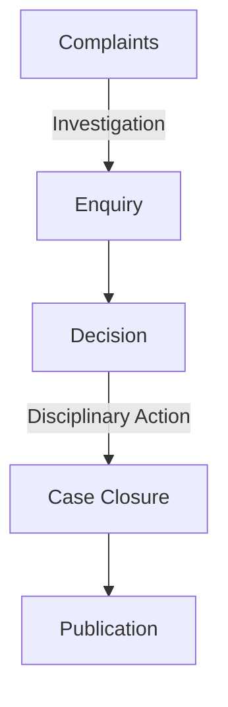

## Introduction: AADB, But No Batteries Included!

When you hear **AADB**, do you think of a high-tech gadget? Well, think again! It stands for **Accountancy and Actuarial Discipline Board**. Yep, less sci-fi, more balance sheets. But don’t switch off yet—this ride will be more fun than watching paint dry (I promise)! 🖌️

## The Lowdown on High Stakes: What is AADB?

Imagine if Sherlock Holmes had a penchant for numbers instead of mysteries. That’s the AADB’s job: investigating and regulating the accountancy and actuarial professions. Think of them as the hall monitors who make sure the accountants and actuaries are doing their homework and not cheating on their exams.

## 🎭 Why Should You Care?

Well, unless you enjoy financial chaos, the AADB is like your nerdy yet crucial best friend. They ensure that standards are upheld in professional conduct. And hey, their rulebook is thicker than a London fog! 🌫️

## Lords of the Ledger: Members of AADB

To become a member of the AADB, you probably need a PhD in handling boredom. But these folks are impressive—seasoned professionals in accountancy and actuarial science. They are like the Jedi Council of numbers, keeping the dark side of shady audits away.

## 🧮 The Formula for Function: What Do They Really Do?

Apart from wearing snazzy suits and engaging in endless paperwork, the AADB’s duties can be boiled down to:

- **Monitoring & Enforcement:** How accountants and actuaries uphold the rules.
- **Disciplinary Actions:** If someone goes off the rails, they bring them back in line.
- **Guidance & Reports:** Constantly updating standards and guidelines.

## The Not-So-Secret Secret: Their Toolbox 📦



```json
{
   myObject = [
      "abcd,
      "efgh"
   ]
}
``


That diagram might look like a conspiracy theorist’s dream, but it’s how the AADB processes a complaint, investigates, and takes action.

## Old Myths, New Truths: Busting AADB Legends 🚀

### Myth: *The AADB is super boring*

**Truth:** Wander into one of their disciplinary hearings, and you’ll witness more drama than a soap opera!

### Myth: *AADB meetings are just tea and biscuits*

**Truth:** Tea is involved, but there’s also a lot of brain-crunching work ensuring financial probity!

## Homework Haven: Test Your AADB Knowledge 🎓

### Quizzes

1. **What's the full form of AADB?**
   - a) Accountancy And Detective Bureau
   - b) Accountancy and Actuarial Discipline Board
   - c) Association of Awesome Debits and Credits
   - d) Academic Association of Discipline Builders

   **Answer:** b) Accountancy and Actuarial Discipline Board
   **Explanation:** While other options sound intriguing, only 'b' keeps our Sherlocks of numbers in line.

2. **Who can become a member of the AADB?**
   - a) Anyone with a calculator
   - b) Seasoned professionals in accounting
   - c) People who enjoy Excel sheets
   - d) Finance students with a 4.0 GPA

   **Answer:** b) Seasoned professionals in accounting
   **Explanation:** It takes more than Excel love; you need to be a fully-stocked pro!

3. **What does the AADB chiefly monitor?**
   - a) Dog shows
   - b) Professional conduct in accountancy
   - c) Fashion trends in finance
   - d) Social media of actuaries

   **Answer:** b) Professional conduct in accountancy
   **Explanation:** While 'd' seems tempting, they focus on professional standards.

4. **Which part of their duty involves reeling in the rule-breakers?**
   - a) Investigative Adventures
   - b) Disciplinary Actions
   - c) Guideline Gala
   - d) Case Closure Carnival

   **Answer:** b) Disciplinary Actions
   **Explanation:** They're the academic police, ensuring rules are revered!

5. **How does AADB’s process start?**
   - a) With a complaint
   - b) By flipping a coin
   - c) Drawing lots
   - d) Random selection

   **Answer:** a) With a complaint
   **Explanation:** Every great investigation needs a humble complaint!

6. **True or False: The AADB only publishes positive reports.**
   - a) True
   - b) False

   **Answer:** b) False
   **Explanation:** They publish the good, the bad, and the ugly (audit results).

7. **In mermaids graphs, which comes after 'Decision'?**
   - a) Investigation
   - b) Enquiry
   - c) Disciplinary Action
   - d) Case Closure

   **Answer:** c) Disciplinary Action
   **Explanation:** After deciding, they act (disciplinarily, of course).

8. **What’s the nerdy yet essential role of the AADB?**
   - a) Ensuring finance professionals follow standards
   - b) Making memes
   - c) Organizing finance-themed parties
   - d) Conducting yoga classes for accountants

   **Answer:** a) Ensuring finance professionals follow standards
   **Explanation:** Someone has to keep the numerical peace!

## Conclusion: Why The AADB Deserves a Standing Ovation 👏

So, there you have it, folks! The AADB is not just an abbreviation you’d dismiss; it’s a crucial cog in the wheels of the financial world. They ensure your friendly neighborhood accountant doesn’t turn into a rogue doing questionable maths. Stay curious, stay informed, and always balance your debits and credits! 💰




---
primaryColor: 'rgb(121, 82, 179)'
secondaryColor: '#DDDDDD'
textColor: black
shuffle_questions: true
---

### What's the full form of AADB?

- [ ] a) Accountancy And Detective Bureau
- [x] b) Accountancy and Actuarial Discipline Board
- [ ] c) Association of Awesome Debits and Credits
- [ ] d) Academic Association of Discipline Builders

> **Explanation:** While other options sound intriguing, only 'b' keeps our Sherlocks of numbers in line.


### Who can become a member of the AADB?

- [ ] a) Anyone with a calculator
- [x] b) Seasoned professionals in accounting
- [ ] c) People who enjoy Excel sheets
- [ ] d) Finance students with a 4.0 GPA

> **Explanation:** It takes more than Excel love; you need to be a fully-stocked pro!


### What does the AADB chiefly monitor?

- [ ] a) Dog shows
- [x] b) Professional conduct in accountancy
- [ ] c) Fashion trends in finance
- [ ] d) Social media of actuaries

> **Explanation:** While 'd' seems tempting, they focus on professional standards.


### Which part of their duty involves reeling in the rule-breakers?

- [ ] a) Investigative Adventures
- [x] b) Disciplinary Actions
- [ ] c) Guideline Gala
- [ ] d) Case Closure Carnival

> **Explanation:** They're the academic police, ensuring rules are revered!


### How does AADB’s process start?

- [x] a) With a complaint
- [ ] b) By flipping a coin
- [ ] c) Drawing lots
- [ ] d) Random selection

> **Explanation:** Every great investigation needs a humble complaint!


### True or False: The AADB only publishes positive reports.

- [ ] a) True
- [x] b) False

> **Explanation:** They publish the good, the bad, and the ugly (audit results).


### In mermaids graphs, which comes after 'Decision'?

- [ ] a) Investigation
- [ ] b) Enquiry
- [x] c) Disciplinary Action
- [ ] d) Case Closure

> **Explanation:** After deciding, they act (disciplinarily, of course).


### What’s the nerdy yet essential role of the AADB?

- [x] a) Ensuring finance professionals follow standards
- [ ] b) Making memes
- [ ] c) Organizing finance-themed parties
- [ ] d) Conducting yoga classes for accountants

> **Explanation:** Someone has to keep the numerical peace!


